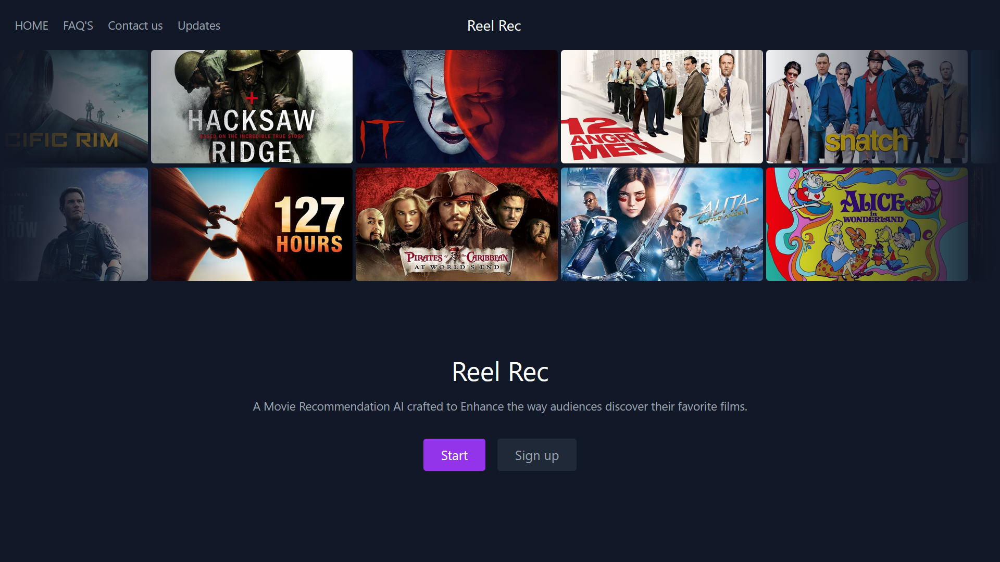
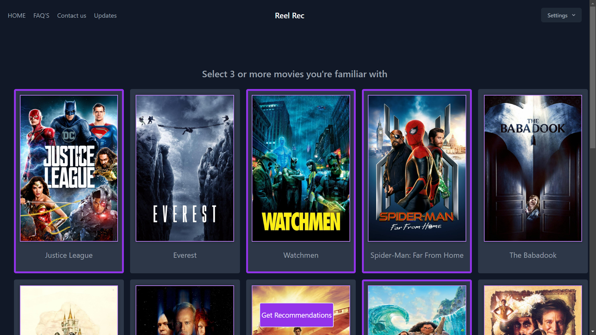
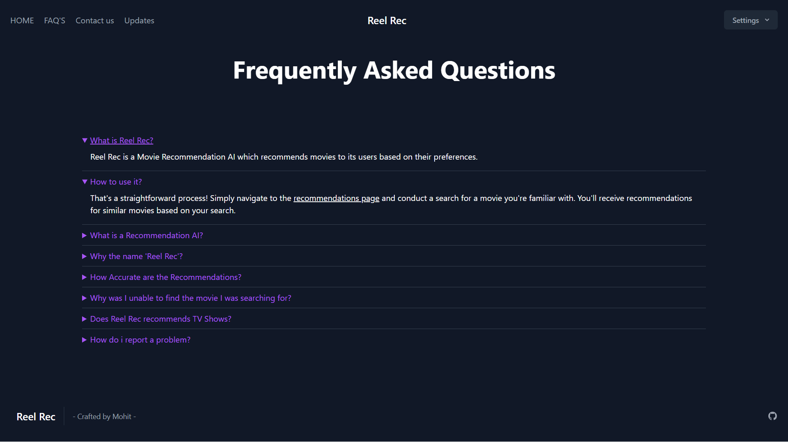

# Reel Rec

### Reel Rec - A Movie Recommendation AI designed to change the way movie enthusiasts discover and enjoy  favorite films.

## Table of Contents
- [Overview](#overview)
- [Requirement Specifications/Tech Stack](#requirement-specifications--tech-stack)
- [Installation](#installation)
- [Screenshots](#screenshots)
- [Usage](#usage)
- [License](#license)
- [Attributions](#attributions)
- [Planned Future Updates](#planned-future-updates)
- [Contributing](#contributing)
- [Contact](#contact)


# Overview
Reel Rec is a content-based recommendation AI developed as a web application using
Django & Tailwind CSS for smooth user experience. Users also signup and receive movie recommendations by simply selecting a movie they're familiar with without restrictions on genre, actor, release date, or film industry & receive Personalized Recommendations. After receiving the recommendations, users have the option to view movie details, watch the trailer through YouTube.

## Requirement Specifications / Tech Stack
- Languages: **Python, Javascript**
- Frameworks: **Tailwind CSS & Django** 
- Database: **MySQL**
- API: **TMDB API** 

## Installation
### Installation Instructions

1. Clone the repository:
    ```sh
    git clone https://github.com/MohitBharambe/Reel-Rec.git
    ```
2. Create & Activate a Virtual Environment (optional):
    ```sh
    python -m venv env # Create
    source env/bin/activate  # for MACOS
    env\Scripts\activate # for Windows
    ```
3. Install the requirements:
    ```sh
    pip install -r requirements.txt
    ```
4. In MySQL Shell, Create a database named `reel_rec`:
    ```sql
    create database reel_rec;
    ```  
5. Create a `.env` file at the root level of the directory with the following variables and assign the respective values:
    ```python
    SECRET_KEY=<any_random_alphanumeric_key>
    MYSQL_USER=<your_mysql_user>
    MYSQL_PASSWORD=<your_mysql_password>
    bearer_token=<your_tmdb_bearer_token>
    ```
6. Inside the `Models` directory Run the `algorithm.ipynb` file Using Jupyter Notebook to generate the Model's  files.

7. Perform migrations:
    ```sh
    python manage.py makemigrations
    python manage.py migrate
    ```
8. Create a Admin User(optional):
    ```sh
    python manage.py createsuperuser
    ```
9. Run the server:
    ```sh
    python manage.py runserver
    ```
10. If the shell output is Similar to the one below , The app can now be accessed at `http://127.0.0.1:8000`
    ```python
    Watching for file changes with StatReloader
    Performing system checks...

    System check identified no issues (0 silenced).
    December 10, 2024 - 15:44:16
    Django version 5.1.4, using settings 'Reel_Rec.settings'
    Starting development server at http://127.0.0.1:8000/
    Quit the server with CTRL-BREAK.
    ```

## Screenshots
### 1 - Select familiar Movies
 
### 2 - Get Recommendations

### FAQ Page


## Usage


## License


This project is licensed under the MIT License. See the [``LICENSE``](https://github.com/MohitBharambe/Reel-Rec/blob/a6a15674b7f740ce16c025ded38cdd61bd155bf2/LICENSE) file for more details.

##  Attributions


This product uses the TMDB API but is not endorsed or certified by TMDB.

- [TMDB API](https://developer.themoviedb.org/reference/intro/getting-started)
- [Dataset Used ](https://www.kaggle.com/datasets/ahsanaseer/top-rated-tmdb-movies-10k)

## Planned Future Updates
- Reel Rec has planned support to implement a collaborative-based approach for recommendations.
- Get Recommendations based on User's Mood.

## Contributing

Thank you for considering contributing to Reel Rec! refer the [``contributing.md``](https://github.com/MohitBharambe/Reel-Rec/blob/a6a15674b7f740ce16c025ded38cdd61bd155bf2/contributing.md) file for making a contribution.

## Contact
- Github:
  
  https://github.com/MohitBharambe

- Email Address: 

  mohitbharambe0@outlook.com
